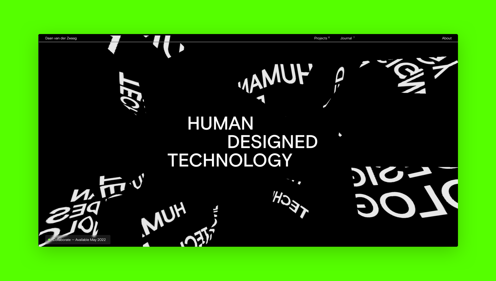

# Checkout more at [🔗 daanvanderzwaag.com](https://daanvanderzwaag.com)

My name is Daan, I design and build (web)apps, mostly for startups, but often in arts and entertainment. My background is in Human-Computer Interaction and currently I do research in Information Science and Urban Tech at [Cornell-Technion](https://www.tech.cornell.edu/jacobs-technion-cornell-institute/) in NYC. Next to this, I am building the startup [Fides](https://fides.systems), where we have a decentralized system for more equitable and privacy-proof personal data. 

*Anyway, enough talk. I am often available for freelance projects, but always up for a chat.* 

[🧑‍💻 Talk to me →](https://cal.com/daan/work-with-me) 

[🔗 Checkout my work →](https://daanvanderzwaag.com) 

[✉️ Send me an email →](mailto:daan@devign.it)